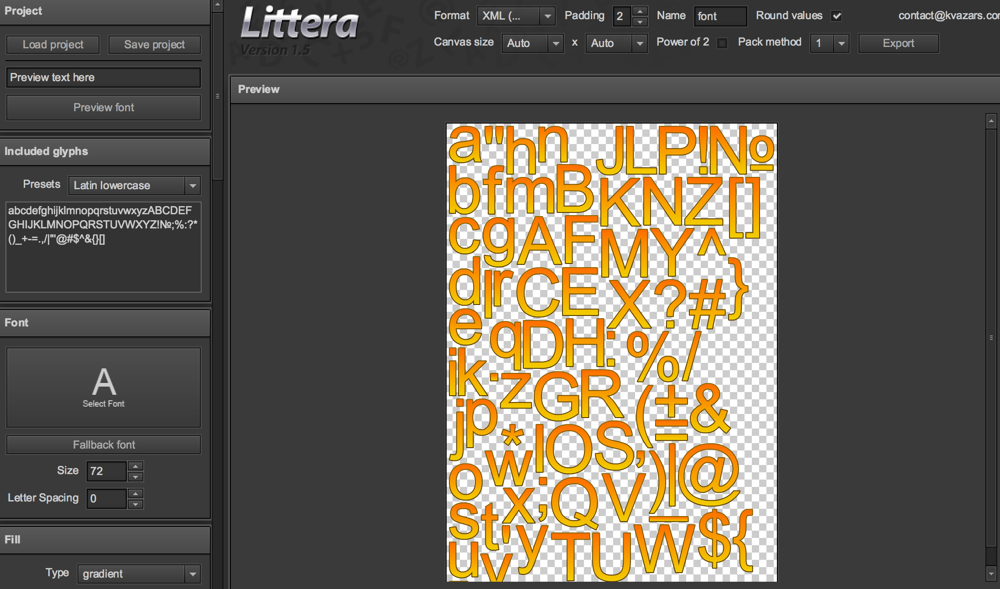
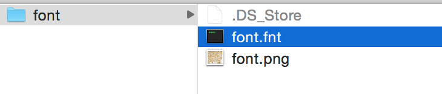
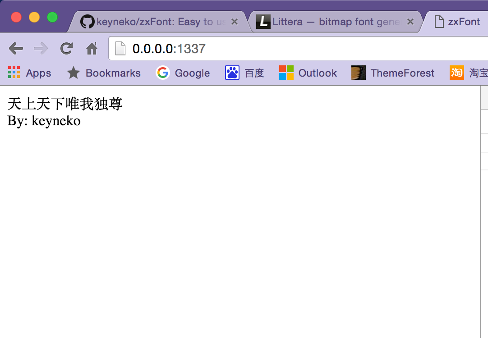
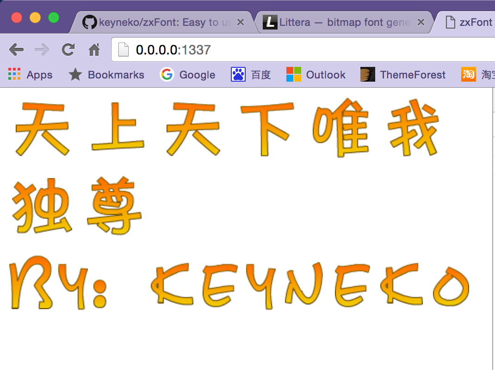

# zxFont
======
> Easy to use bitmap instead of art font in web page


## Usage
first, you need to generate bitmap fonts, I recommend using this online tool [littera](http://kvazars.com/littera/), or other tools like [hiero](https://github.com/libgdx/libgdx/wiki/Hiero).  



the generated font includes `.fnt` and `.png` two type files. the `.fnt` use `XML` format that describes all of the informations. the .png is font bitmap textures, can have multiple pages of `.png`.  



sample usage as follows:

```javascript
import ZxFont from './lib/ZxFont'

var zxfont = new ZxFont()
zxfont.load('font', './assets/font/')
zxfont.convert('font', '.font')
```
before convert:  



after convert:  



## History

 - _1.0.0_ : initial release

## License

Copyright (c) 2016 keyneko `<keyneko@live.cn>`
Licensed under the MIT license.
